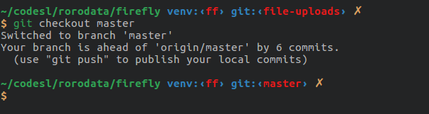

# pal theme for Oh My ZSH

## Features

* Minimal
* Clean
* Supports `git` and `virtualenv`

## Installation

1. Clone the repo.
2. Copy [`pal.zsh-theme`](pal.zsh-theme) into the `~/.oh-my-zsh/themes/` directory or `~/.antigen/bundles/robyrusell/oh-my-zsh/themes/` directory if you use `antigen` for package management.
3. Change `ZSH_THEME` variable in `~/.zshrc` to `ZSH_THEME="pal"` or write `antigen theme pal` if you use `antigen`.
4. Reload ZSH now by `source ~/.zshrc`.

## Contributing

Suggestions are more than welcome with regards to
the colors and prompt.
